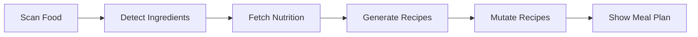
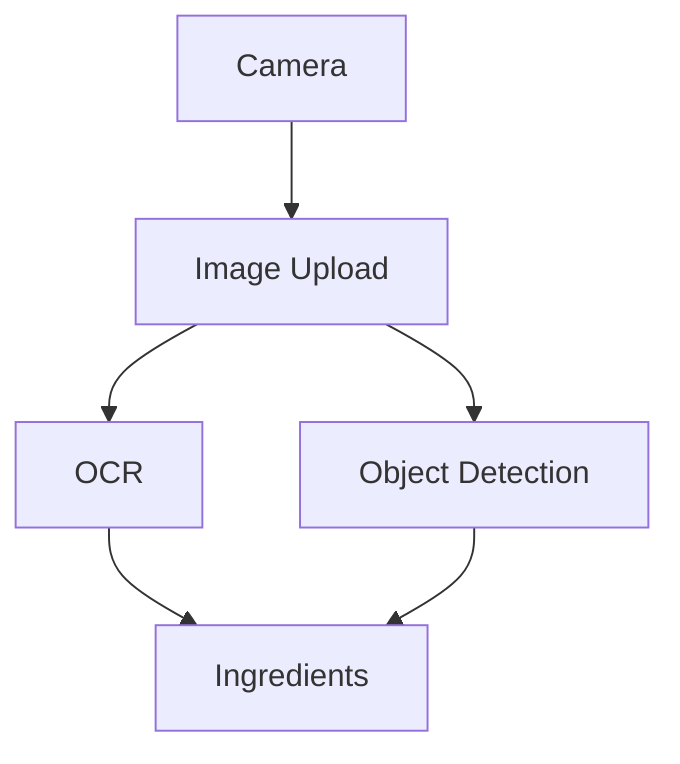
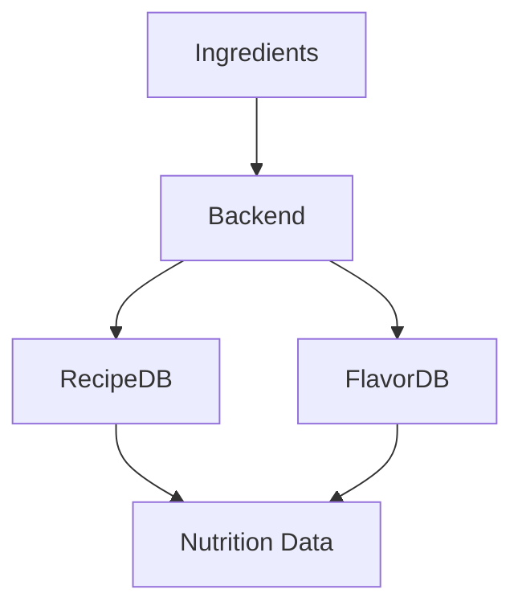
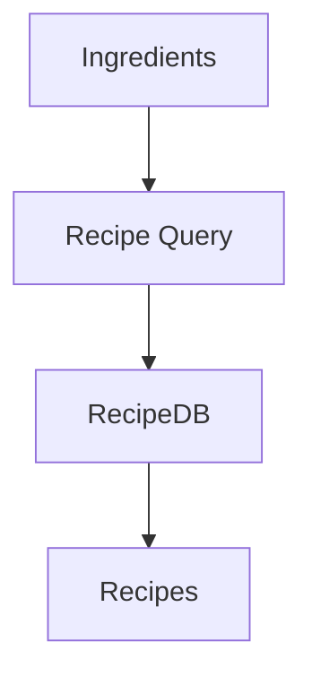
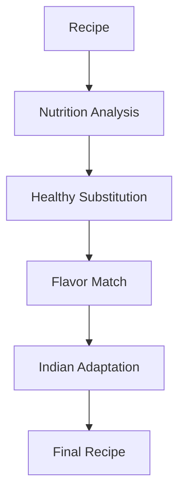
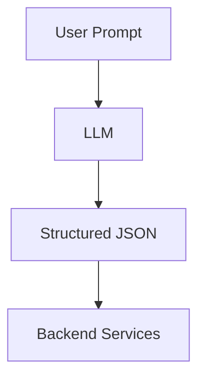
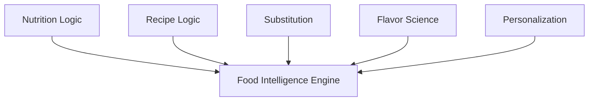
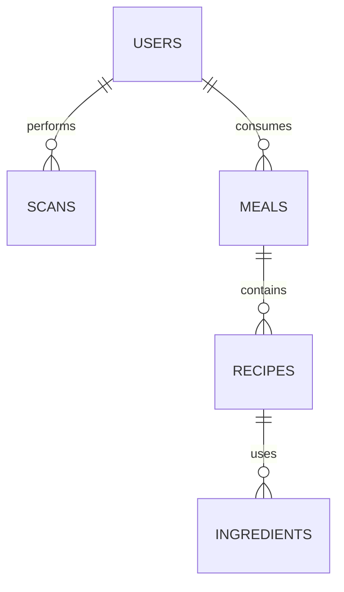

#  NutriLens AI
## Food Intelligence Scanner & Recipe Mutation Engine
### Powered by Foodoscope APIs

---

#  System Overview

NutriLens AI is a computational food intelligence platform that:

- scans food using camera
- detects ingredients via OCR + Computer Vision
- computes nutrition via Foodoscope APIs
- classifies health quality
- generates recipes
- mutates recipes into healthier & Indian-style versions
- provides conversational cooking guidance using LLMs

---

# Core Idea

Transform:

Food (Image/Text)
→ Structured Ingredients
→ Nutrition Intelligence
→ Recipe Generation
→ Recipe Mutation (Healthy + Indian)
→ Actionable Meal Plan

---


#  High Level Architecture

```
Client → API Gateway → Backend → Intelligence Engine → Foodoscope APIs → DB
```


---

#  Layered Architecture

## 1️ Presentation Layer
- Mobile / Web App
- Scan camera
- Dashboard
- Meal plans
- Chat assistant

## 2️ API Gateway
- Auth
- Rate limiting
- Routing
- Logging

## 3️ Backend Services
- Image Processing Service
- Food Classification Service
- Nutrition Engine
- Recipe Engine
- Mutation Engine
- LLM Orchestrator
- Recommendation Engine

## 4️ External Layer
- Foodoscope RecipeDB
- Foodoscope FlavorDB
- LLM Provider

## 5️ Storage Layer
- Users
- Meals
- Recipes
- Nutrition
- History


---

#  COMPLETE USER FLOW




---

#  STEP-WISE FLOWS

---

## Step 1 - Scan & Detect



---

## Step 2 - Nutrition Fetch



---

## Step 3 - Recipe Generation



---

## Step 4 - Mutation Engine



---

## Step 5 - LLM Structuring



---


# Core Brain



---


#  BACKEND API ENDPOINTS (FULL SPEC)

---

##  Auth

### POST /auth/signup
Create user

### POST /auth/login
Login user

### GET /auth/me
Fetch current user

---

##  User Profile

### GET /user/profile
Fetch user profile

### PUT /user/profile
Update preferences (diet, disease, allergies)

### GET /user/history
Past meals & scans

---

##  Scan Service

### POST /scan/image
Upload image  
Response → detected ingredients

### POST /scan/barcode
Scan packaged food

### POST /scan/manual
Manual ingredient input

---

## Ingredient Intelligence

### POST /ingredients/classify
veg/non-veg/processed

### POST /ingredients/nutrition
Fetch nutrition (Foodoscope)

### POST /ingredients/health-score
Compute health rating

---

##  Recipe Engine

### POST /recipes/generate
Generate recipes from ingredients

### POST /recipes/filter
Filter by calories/goal

### GET /recipes/:id
Get recipe details

---

##  Mutation Engine 

### POST /recipes/mutate
Transform recipe → healthier

### POST /recipes/indianize
Convert to Indian style

### POST /recipes/substitute
Ingredient substitution

---

##  Meal Planning

### POST /meal-plan/generate
Daily/weekly plan

### GET /meal-plan/today
Today meals

### GET /meal-plan/week
Weekly plan

---

##  LLM Service

### POST /chat
Natural language query

### POST /chat/recipe-help
Cooking instructions

---

##  Analytics

### GET /analytics/nutrition
Macro/micro summary

### GET /analytics/health-score
User diet quality

---

##  Doctor/Dietician Mode (optional)

### GET /doctor/patients
Patient list

### GET /doctor/patient/:id
Patient diet data

### POST /doctor/assign-plan
Assign plan

---


# 🗄 Database Model (Logical)



---

#  Deployment

- Frontend → Vercel
- Backend → Docker/FastAPI/Node
- DB → PostgreSQL/Mongo
- Foodoscope APIs → External
- LLM → External

---

# ⚙ Scalability

- stateless services
- caching
- async jobs
- microservices
- horizontal scaling

---

#  MVP Scope

Must:
- scan
- ingredient detection
- Foodoscope nutrition
- recipe generation
- mutation

Avoid:
- heavy ML
- fancy UI

---

## Final Summary

NutriLens AI:

- sees food
- understands nutrition
- generates recipes
- mutates intelligently
- adapts to Indian kitchens

Not a diet tracker.

Not a recipe app.

A Computational Food Intelligence Platform.
